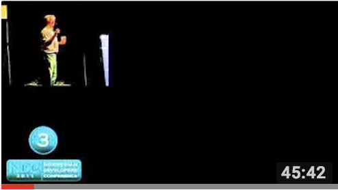

# Craftsmanship / Agile / XP

- [Robert C. Martin - The Land that Scrum Forgot](https://www.youtube.com/watch?v=hG4LH6P8Syk)

    

    Scrum is the most popular of all the Agile methods. Tens of thousands of people have been certified as Scrum Masters. Thousands of projects have use Scrum to get great work done. But there's a problem. Some of those projects fail, and fail badly. The reason they fail is that Scrum forgot something. Scrum forgot to incorporate the technical disciplines that make Agile work. Disciplines like Test Driven Development, Continuous Integration, Simple Design, Refactoring, and Pair Programming. In this talk Uncle Bob will describe those missing disciplines, and tell you how to rescue your Scrum projects from failure by adopting those disciplines
- [Flaccid Scrum](https://martinfowler.com/bliki/FlaccidScrum.html)
- [Flaccid Agile?](https://medium.com/@marko.bjelac/flaccid-agile-308be2982174)

# TDD

### Posts
- [Unit testing and TDD misconceptions](https://www.linkedin.com/pulse/unit-testing-tdd-misconceptions-marko-bjelac/)
- [Moving Parts](http://bit.ly/parts-moving)
- [“Uncle Bob” Martin Speaks at Yale SOM](https://som.yale.edu/news/2014/09/uncle-bob-martin-speaks-yale-som)

### Videos

### Twitch
[WeDoTDD's TDD Stream](https://www.twitch.tv/wedotdd)
- also check out [WeDoTDD.com](WeDoTDD.com)

[Joe Bew's TDD Stream](https://www.twitch.tv/videos/295109802) *[about Joe](https://joebew42.github.io/twitch/about/)*</a>

[Coding it Wrong's TDD Stream](https://www.twitch.tv/videos/295562825)

### YouTube

- [8th Light](https://www.youtube.com/channel/UClJNsSHF9yR-MU4v-VosZ1A/videos)
- [Sandro Mancusco](https://www.youtube.com/user/sandromancuso/videos)
- [Adi Bolboaca](https://www.youtube.com/channel/UC7H7P2tu2i3Wnz-ZBdnO13Q)
- [Clean Coders](https://www.youtube.com/user/cleancoders/videos)
- [Chris Holland](https://www.youtube.com/channel/UCtGq0kpqgpc83ShN_rZQFbA) *[about Chris](https://twitter.com/chrisholland)*</a>
- [Roy Osherove 1](https://www.youtube.com/channel/UCM9Jz0z1IXlgGy_CY3wGRWA)
- [Roy Osherove 2](https://www.youtube.com/channel/UCuDFkDK8Y_CQFV2zPHfhWIQ?pbjreload=10)
- [Codurance](https://www.youtube.com/channel/UCacyhBPMQpC4Vi-WqtrRpBw)

### Talks
- [JavaScript is too convenient](https://vimeo.com/267418198?activityReferer=1) -  SCNA - Sam Jones of Test Double

# JavaScript
### Posts
### Videos
- [Philip Roberts: What the heck is the event loop anyway?](https://www.youtube.com/watch?v=8aGhZQkoFbQ)

    

- [Fun Fun Function](https://www.youtube.com/channel/UCO1cgjhGzsSYb1rsB4bFe4Q)
- [JavaScript is too convenient](https://vimeo.com/267418198?activityReferer=1) -  SCNA - Sam Jones of Test Double

### General JS
- [You-Dont-Know-JS](https://github.com/getify/You-Dont-Know-JS)

